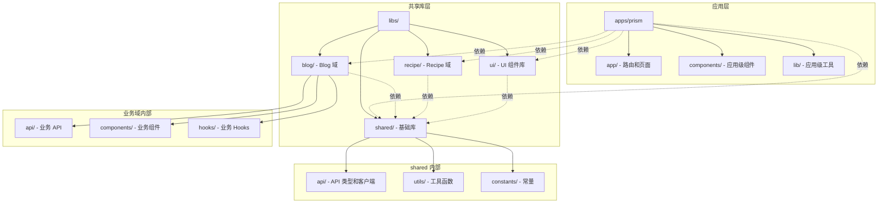

# 目录结构规范

本文档定义了 Prism 项目的目录组织方式和文件放置规则，是所有代码重构和新增代码的"宪法"。

## 📁 总体结构

```
Prism/
├── apps/                    # 应用层
│   └── prism/              # Next.js 主应用
│       ├── app/            # Next.js App Router
│       ├── components/     # 应用级组件（页面特定）
│       ├── lib/            # 应用级工具函数
│       └── ...
├── libs/                    # 共享库层
│   ├── shared/             # 共享基础库
│   ├── ui/                 # UI 组件库
│   ├── blog/               # Blog 业务域库
│   └── recipe/             # Recipe 业务域库
├── docs/                    # 文档
│   ├── architecture/       # 架构文档
│   └── development/        # 开发指南
├── tools/                   # 工具脚本
└── ...
```

## 🎯 目录职责说明

### 应用层 (`apps/prism/`)

**职责：** 应用入口、路由、页面组合、应用级配置

#### `apps/prism/app/`

- **用途：** Next.js App Router 路由和页面
- **放置规则：**
  - **路由文件：**
    - `page.tsx` - 页面组件（默认 Server Component）
    - `layout.tsx` - 布局组件（默认 Server Component）
    - `loading.tsx` - 加载状态组件（Server Component）
    - `error.tsx` - 错误边界组件（必须是 Client Component）
    - `not-found.tsx` - 404 页面（Server Component）
    - `template.tsx` - 模板组件（每次导航重新挂载）
  - **路由结构：**
    - 静态路由：`blog/page.tsx` → `/blog`
    - 动态路由：`blog/[slug]/page.tsx` → `/blog/:slug`
    - 路由组：`(marketing)/about/page.tsx` → `/about`（不影响 URL）
    - 并行路由：`@analytics/page.tsx`（需要配合 `layout.tsx` 使用）
  - **API 路由：** `api/route.ts` - API 端点（Route Handler）
  - **特殊目录：**
    - `components/` - 页面级组件（仅在该路由下使用）
    - `providers.tsx` - 应用级 Provider 组件
  - **Server vs Client Components：**
    - 默认是 Server Component（无需 `'use client'`）
    - 需要交互时使用 `'use client'` 标记为 Client Component
    - Server Component 可以直接使用 async/await 获取数据
  - **禁止：** 复杂业务逻辑（应放在业务域库）

#### `apps/prism/components/`

- **用途：** 应用级组合组件（页面特定或应用级布局）
- **放置规则：**
  - ✅ **应用级布局组件**：如 `AppLayout`、`MainLayout`（组合多个业务组件）
  - ✅ **页面特定组件**：只在某个或某几个页面使用，如 `HomePageHero`、`BlogPageHeader`
  - ✅ **路由级组件**：放在 `app/[route]/components/` 下，仅在该路由使用
  - ✅ **应用级 Provider**：如 `ThemeProvider`、`AuthProvider`（如果应用特定）
  - ❌ **禁止：** 可复用的 UI 组件（应放在 `libs/ui/components/`）
  - ❌ **禁止：** 业务域组件（应放在 `libs/[domain]/components/`）
  - ❌ **禁止：** 跨页面复用的组件（应放在业务域库）

**判断标准：**

- 如果组件只在一个或几个特定页面使用 → `apps/prism/components/`
- 如果组件在某个业务域的所有页面使用 → `libs/[domain]/components/`
- 如果组件是纯 UI，无业务逻辑 → `libs/ui/components/`

**示例：**

```typescript
// ✅ 正确：应用级布局组件
// apps/prism/components/AppLayout.tsx
export function AppLayout({ children }) {
  return (
    <div>
      <Header /> {/* 应用级 Header */}
      <main>{children}</main>
      <Footer /> {/* 应用级 Footer */}
    </div>
  );
}

// ✅ 正确：页面特定组件
// apps/prism/components/HomePageHero.tsx
export function HomePageHero() {
  // 只在首页使用
}

// ❌ 错误：可复用 UI 组件
// apps/prism/components/Button.tsx - 应该放在 libs/ui/components/
```

#### `apps/prism/lib/`

- **用途：** 应用级工具函数和配置
- **放置规则：**
  - Next.js 特定配置（如 `next.config.js` 辅助函数）
  - 应用级常量
  - **禁止：** 通用工具函数（应放在 `libs/shared/utils/`）

---

### 共享库层 (`libs/`)

#### `libs/shared/` - 共享基础库

**职责：** 跨业务域共享的基础能力

```
libs/shared/
├── api/                    # API 相关
│   ├── types/              # API 类型定义
│   │   ├── common.ts       # 通用响应类型
│   │   └── errors.ts       # 错误类型
│   ├── client.ts           # API 客户端
│   └── index.ts
├── utils/                  # 工具函数
│   ├── format.ts           # 格式化工具
│   ├── validation.ts       # 验证工具
│   └── index.ts
├── constants/              # 常量定义
│   ├── routes.ts           # 路由常量
│   └── index.ts
└── index.ts                # 统一导出
```

**放置规则：**

- ✅ 跨业务域使用的类型、工具、常量
- ✅ API 通用类型和客户端
- ❌ 业务特定逻辑
- ❌ UI 组件

#### `libs/ui/` - UI 组件库

**职责：** 可复用的 UI 组件（无业务逻辑）

```
libs/ui/
├── components/             # UI 组件
│   ├── button/
│   │   ├── Button.tsx
│   │   ├── Button.test.tsx
│   │   └── index.ts
│   ├── input/
│   └── ...
├── hooks/                  # UI 相关 Hooks
└── index.ts
```

**放置规则：**

- ✅ 纯展示组件（Button、Input、Card 等）
- ✅ 通用布局组件
- ✅ UI 相关的 Hooks（如 `useMediaQuery`）
- ❌ 业务逻辑
- ❌ 数据获取逻辑

#### `libs/[domain]/` - 业务域库

**职责：** 特定业务域的所有代码（API、组件、Hooks、类型）

```
libs/blog/
├── api/                    # Blog API
│   ├── types.ts            # Blog 类型定义
│   ├── queries.ts          # 查询函数
│   └── mutations.ts        # 变更函数
├── components/             # Blog 业务组件
│   ├── BlogCard/
│   ├── BlogList/
│   └── ...
├── hooks/                  # Blog 业务 Hooks
│   ├── useBlogPosts.ts
│   └── ...
└── index.ts
```

**放置规则：**

- ✅ 业务域相关的所有代码
- ✅ 业务组件（包含业务逻辑）
- ✅ 业务 Hooks
- ✅ 业务类型定义
- ❌ 跨业务域共享的代码（应放在 `shared/`）

**命名规范：**

- 业务域名称使用小写、单数形式
- 示例：`blog`, `recipe`, `user`, `order`

---

## 📊 目录结构图



---

## 📝 文件命名规范

### 组件文件

- **React 组件：** 使用 PascalCase，如 `BlogCard.tsx`
- **组件目录：** 与组件名一致，如 `BlogCard/BlogCard.tsx`
- **导出文件：** `index.ts` 统一导出

### 工具函数文件

- **文件名：** 使用 kebab-case，如 `format-date.ts`
- **导出函数：** 使用 camelCase，如 `formatDate`

### 类型定义文件

- **文件名：** 使用 kebab-case，如 `api-types.ts` 或 `types.ts`
- **类型名：** 使用 PascalCase，如 `ApiResponse<T>`

### 常量文件

- **文件名：** 使用 kebab-case，如 `route-constants.ts`
- **常量名：** 使用 UPPER_SNAKE_CASE，如 `API_BASE_URL`

---

## 🔍 文件放置决策树

### 判断组件应该放在哪里？

```
开始
  │
  ├─ 是纯展示组件（无业务逻辑，可跨项目使用）？
  │   └─ 是 → libs/ui/components/
  │   └─ 否 ↓
  │
  ├─ 是特定业务域的组件（包含业务逻辑）？
  │   └─ 是 → libs/[domain]/components/
  │   └─ 否 ↓
  │
  ├─ 是应用级布局或组合组件？
  │   └─ 是 → apps/prism/components/
  │   └─ 否 ↓
  │
  └─ 是页面特定组件（只在 1-2 个页面使用）？
      └─ 是 → apps/prism/components/ 或 app/[route]/components/
      └─ 否 → 重新评估，可能应该放在业务域库
```

### 判断工具函数应该放在哪里？

```
开始
  │
  ├─ 是跨业务域使用的通用工具？
  │   └─ 是 → libs/shared/utils/
  │   └─ 否 ↓
  │
  ├─ 是特定业务域的工具？
  │   └─ 是 → libs/[domain]/utils/
  │   └─ 否 ↓
  │
  └─ 是应用级工具（Next.js 特定）？
      └─ 是 → apps/prism/lib/
```

### 判断类型定义应该放在哪里？

```
开始
  │
  ├─ 是 API 通用类型（跨业务域）？
  │   └─ 是 → libs/shared/api/types/
  │   └─ 否 ↓
  │
  ├─ 是特定业务域的类型？
  │   └─ 是 → libs/[domain]/api/types.ts
  │   └─ 否 ↓
  │
  └─ 是组件 Props 类型？
      └─ 与组件放在一起
```

---

## ✅ 最佳实践

### 1. 模块化组织

- 每个业务域是独立的库，可以独立开发和测试
- 使用 `index.ts` 统一导出，隐藏内部实现

### 2. 依赖方向

- **应用层** → **业务域库** → **共享库**
- **禁止反向依赖**：共享库不能依赖业务域库

### 3. 代码复用

- 跨业务域共享 → `libs/shared/`
- 业务域内共享 → `libs/[domain]/`
- 应用内共享 → `apps/prism/`

### 4. Next.js Server/Client Components

- **默认使用 Server Component**：更好的性能和 SEO
- **仅在需要时使用 Client Component**：
  - 需要交互（onClick、onChange 等）
  - 使用浏览器 API（localStorage、window 等）
  - 使用 React Hooks（useState、useEffect 等）
  - 使用第三方客户端库
- **数据获取**：Server Component 可以直接使用 async/await
- **标记方式**：在文件顶部添加 `'use client'` 指令

```typescript
// ✅ Server Component（默认）
// app/blog/page.tsx
export default async function BlogPage() {
  const posts = await fetchBlogPosts(); // 直接获取数据
  return <BlogList posts={posts} />;
}

// ✅ Client Component（需要交互）
// app/blog/components/BlogSearch.tsx
('use client');
export function BlogSearch() {
  const [query, setQuery] = useState('');
  return <input value={query} onChange={e => setQuery(e.target.value)} />;
}
```

### 5. 测试文件

- 单元测试：与源文件放在同一目录，如 `Button.test.tsx`
- E2E 测试：`apps/prism/e2e/`

---

## 🚫 常见错误

### ❌ 错误示例 1：业务逻辑放在 UI 组件库

```typescript
// ❌ libs/ui/components/BlogCard.tsx
export function BlogCard() {
  const { data } = useBlogPosts(); // 业务逻辑！
  return <div>{data.title}</div>;
}
```

```typescript
// ✅ libs/blog/components/BlogCard.tsx
export function BlogCard({ post }: { post: BlogPost }) {
  return <div>{post.title}</div>; // 纯展示
}
```

### ❌ 错误示例 2：通用工具放在应用层

```typescript
// ❌ apps/prism/lib/format-date.ts
export function formatDate(date: Date) {
  // 通用工具，应该放在 shared
}
```

```typescript
// ✅ libs/shared/utils/format-date.ts
export function formatDate(date: Date) {
  // 通用工具
}
```

### ❌ 错误示例 3：跨业务域代码放在业务域库

```typescript
// ❌ libs/blog/api/types.ts
export interface ApiResponse<T> {
  // 这是通用类型，应该放在 shared
}
```

```typescript
// ✅ libs/shared/api/types/common.ts
export interface ApiResponse<T> {
  // 通用类型
}
```

### ❌ 错误示例 4：可复用 UI 组件放在应用层

```typescript
// ❌ apps/prism/components/ui/Button.tsx
export function Button() {
  // 这是通用 UI 组件，应该放在 libs/ui/
}
```

```typescript
// ✅ libs/ui/components/button/Button.tsx
export function Button() {
  // 通用 UI 组件
}
```

### ❌ 错误示例 5：在 Server Component 中使用客户端 API

```typescript
// ❌ app/blog/page.tsx
export default function BlogPage() {
  const [posts, setPosts] = useState([]); // 错误！Server Component 不能使用 useState
  useEffect(() => {
    // 错误！Server Component 不能使用 useEffect
  }, []);
  return <div>...</div>;
}
```

```typescript
// ✅ app/blog/page.tsx（Server Component）
export default async function BlogPage() {
  const posts = await fetchBlogPosts(); // 正确：直接获取数据
  return <BlogList posts={posts} />;
}

// ✅ app/blog/components/BlogClient.tsx（Client Component）
('use client');
export function BlogClient() {
  const [posts, setPosts] = useState([]);
  useEffect(() => {
    // 正确：Client Component 可以使用 Hooks
  }, []);
  return <div>...</div>;
}
```

---

## 🔄 Next.js 特殊目录说明

### `app/api/` - API 路由

- **用途：** Next.js Route Handlers（API 端点）
- **放置规则：**
  - `app/api/[route]/route.ts` - 定义 API 端点
  - 支持 GET、POST、PUT、DELETE 等方法
  - 用于服务端 API，替代传统 API 路由

```typescript
// app/api/blog/route.ts
export async function GET() {
  return Response.json({ posts: [] });
}
```

### `app/(group)/` - 路由组

- **用途：** 组织路由但不影响 URL 路径
- **放置规则：**
  - 使用括号命名：`(marketing)`, `(dashboard)`
  - 可以共享布局：`(marketing)/layout.tsx`
  - URL 不包含组名：`(marketing)/about/page.tsx` → `/about`

### `app/@slot/` - 并行路由

- **用途：** 并行渲染多个页面段
- **放置规则：**
  - 需要配合 `layout.tsx` 使用
  - 用于复杂布局场景（如仪表板）

### `app/[...slug]/` - 捕获所有路由

- **用途：** 捕获所有未匹配的路由
- **放置规则：**
  - 用于 404 处理或动态路由
  - 必须放在最后

---

## 📚 相关文档

- [导入规范](./import-rules.md) - 如何使用路径别名导入代码
- [模块边界规则](./module-boundaries.md) - 模块之间的依赖关系
- [TypeScript 规范](./typescript-standards.md) - 类型定义规范
- [Next.js 官方文档](https://nextjs.org/docs) - Next.js App Router 完整指南

---

**最后更新：** 2024-12-19  
**维护者：** 架构团队
